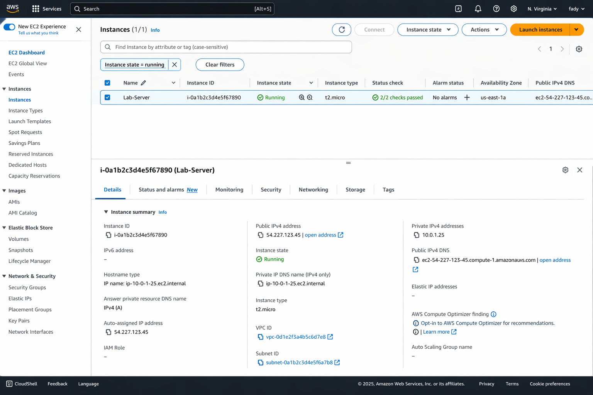

# Lab 1: Virtualization and Cloud Fundamentals

This lab explores the foundational concepts of virtualization, containerization, and cloud infrastructure, with a focus on understanding latency behavior in distributed cloud applications.

---

## Objectives

- Compare Virtual Machines (VMs) and Containers
- Analyze latency patterns in cloud-based applications
- Understand tail latency and its impact on system performance
- Explore AWS EC2 and the Nitro Hypervisor architecture

---

## Architecture Overview

```
┌─────────────────────────────────────────────────────────────┐
│                      CLIENT REQUEST                          │
└─────────────────────────────┬───────────────────────────────┘
                              │
                              ▼
┌─────────────────────────────────────────────────────────────┐
│                     FLASK API SERVER                         │
│  ┌───────────────────────────────────────────────────────┐  │
│  │  Endpoint: /                                          │  │
│  │  - Simulates network latency (random delay)           │  │
│  │  - Returns response time metrics                      │  │
│  └───────────────────────────────────────────────────────┘  │
│  ┌───────────────────────────────────────────────────────┐  │
│  │  Endpoint: /data?size=N                               │  │
│  │  - Generates dataset of specified size                │  │
│  │  - Simulates data retrieval latency                   │  │
│  └───────────────────────────────────────────────────────┘  │
└─────────────────────────────────────────────────────────────┘
                              │
                              ▼
┌─────────────────────────────────────────────────────────────┐
│                    CONTAINER RUNTIME                         │
│              (Docker / AWS EC2 / Nitro)                      │
└─────────────────────────────────────────────────────────────┘
```

---

## VM vs Container Comparison

| Aspect | Virtual Machine | Container |
|--------|-----------------|-----------|
| **Startup Time** | 30-60 seconds | 1-2 seconds |
| **Memory Overhead** | High (full OS) | Low (shared kernel) |
| **Isolation Level** | Strong (hardware-level) | Moderate (process-level) |
| **Portability** | Limited | High |
| **Resource Efficiency** | Lower | Higher |
| **Use Case** | Legacy apps, strong isolation | Microservices, rapid scaling |

### Why Containers Win for Microservices

Containers share the host OS kernel, eliminating the need for a separate operating system per instance. This results in:

- **Faster deployment**: Applications start in seconds
- **Better resource utilization**: More containers per host
- **Consistent environments**: "Works on my machine" is eliminated

---

## Latency Analysis

The application simulates real-world cloud latency by introducing random delays in API responses.

### Key Observations

1. **Response Time Variability**: Each request experiences different latency due to simulated network conditions
2. **Long-Tail Distribution**: Most requests are fast, but some experience significantly higher delays
3. **P99 Latency**: The 99th percentile latency is critical for user experience in production systems

### Latency Distribution


The histogram shows a typical latency distribution where:
- Most requests complete within the expected timeframe
- A "tail" of slower requests exists (tail latency)
- This pattern mirrors real-world cloud application behavior

---

## Tail Latency

**Tail latency** refers to the slowest responses in a system, typically measured at the 99th or 99.9th percentile.

### Why It Matters

| Percentile | Impact |
|------------|--------|
| P50 (Median) | Typical user experience |
| P90 | 1 in 10 users affected |
| P99 | 1 in 100 users affected |
| P99.9 | Critical for high-traffic systems |

In systems handling millions of requests, even P99.9 latency affects thousands of users daily.

### Causes of Tail Latency

- Garbage collection pauses
- Network congestion
- Resource contention
- Cold starts in serverless environments

---

## Resource Utilization

### System Memory Analysis


The host system utilizes approximately 11 GB of memory, demonstrating:
- **VM Overhead**: Traditional virtualization requires significant memory for each guest OS
- **Container Efficiency**: Containers share the host kernel, dramatically reducing memory consumption
- **Scalability Impact**: Lower memory per instance = more services per host

---

## AWS Cloud Infrastructure

### EC2 Instance Deployment



Amazon EC2 provides the foundation for cloud deployments with:

- **On-demand scaling**: Spin up instances as needed
- **Multiple instance types**: Optimize for compute, memory, or storage
- **Global availability**: Deploy across multiple regions

### Nitro Hypervisor

AWS Nitro is a purpose-built hypervisor that:

| Feature | Benefit |
|---------|---------|
| Hardware offloading | Networking and storage handled by dedicated hardware |
| Security | Isolation enforced at the hardware level |
| Performance | Near bare-metal performance for instances |
| Efficiency | More resources available for customer workloads |

---

## How to Run

### Prerequisites

- Docker installed and running
- Python 3.9+ (for local development)

### Docker Deployment

```bash
# Build the image
docker build -t lab1-api .

# Run the container
docker run -p 5000:5000 lab1-api

# Test the API
curl http://localhost:5000
curl http://localhost:5000/data?size=100
```

### Local Development

```bash
# Install dependencies
pip install -r requirements.txt

# Run the application
python app.py

# Access at http://localhost:5000
```

---

## API Endpoints

| Endpoint | Method | Description | Response |
|----------|--------|-------------|----------|
| `/` | GET | Returns response with simulated delay | `{"message": "Mobile Cloud API", "delay": 0.xx}` |
| `/data?size=N` | GET | Returns N data items | `{"data": [...], "count": N}` |
| `/health` | GET | Health check | `{"status": "healthy"}` |

---

## Key Takeaways

1. **Containers are more efficient** than VMs for microservices due to shared kernel architecture
2. **Tail latency** is a critical metric that affects real user experience
3. **Cloud infrastructure** (like AWS EC2 with Nitro) provides the foundation for scalable deployments
4. **Performance monitoring** is essential for understanding system behavior under load

---

## Further Reading

- [AWS Nitro System](https://aws.amazon.com/ec2/nitro/)
- [Understanding Tail Latency](https://www.brendangregg.com/blog/2014-07-24/latency-analysis-with-bcc.html)
- [Docker vs VMs](https://www.docker.com/resources/what-container/)
