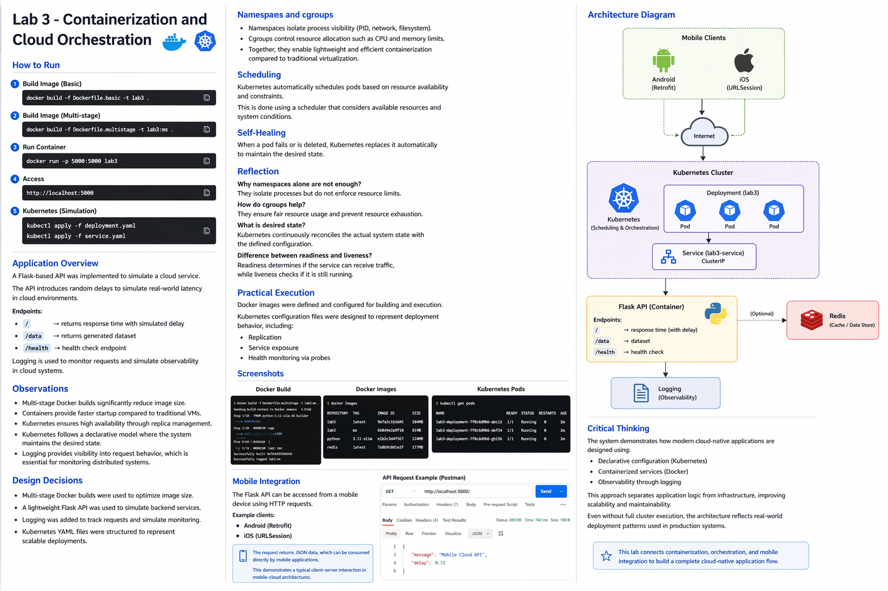

# Lab 3: Containerization and Kubernetes Orchestration

This lab covers containerization best practices and container orchestration using Kubernetes, including deployment strategies, health monitoring, and auto-scaling.

---

## Objectives

- Master Docker containerization with multi-stage builds
- Understand Kubernetes deployment and service configurations
- Implement health checks (liveness and readiness probes)
- Configure horizontal pod autoscaling (HPA)

---

## Architecture Overview

```
┌─────────────────────────────────────────────────────────────────────────────┐
│                            KUBERNETES CLUSTER                                │
│                                                                              │
│  ┌───────────────────────────────────────────────────────────────────────┐  │
│  │                          SERVICE (LoadBalancer)                        │  │
│  │                           mobile-cloud-service                         │  │
│  │                              Port: 80 → 5000                           │  │
│  └───────────────────────────────────┬───────────────────────────────────┘  │
│                                      │                                       │
│                         ┌────────────┴────────────┐                         │
│                         │      Load Balancing     │                         │
│                         └────────────┬────────────┘                         │
│                                      │                                       │
│         ┌────────────────────────────┼────────────────────────────┐         │
│         │                            │                            │         │
│         ▼                            ▼                            ▼         │
│  ┌─────────────────┐     ┌─────────────────┐     ┌─────────────────┐       │
│  │      POD 1      │     │      POD 2      │     │      POD N      │       │
│  │  ┌───────────┐  │     │  ┌───────────┐  │     │  ┌───────────┐  │       │
│  │  │  Flask    │  │     │  │  Flask    │  │     │  │  Flask    │  │       │
│  │  │   API     │  │     │  │   API     │  │     │  │   API     │  │       │
│  │  │ Port:5000 │  │     │  │ Port:5000 │  │     │  │ Port:5000 │  │       │
│  │  └───────────┘  │     │  └───────────┘  │     │  └───────────┘  │       │
│  │                 │     │                 │     │                 │       │
│  │  Liveness  ✓    │     │  Liveness  ✓    │     │  Liveness  ✓    │       │
│  │  Readiness ✓    │     │  Readiness ✓    │     │  Readiness ✓    │       │
│  └─────────────────┘     └─────────────────┘     └─────────────────┘       │
│                                                                              │
│  ┌───────────────────────────────────────────────────────────────────────┐  │
│  │                    HORIZONTAL POD AUTOSCALER (HPA)                     │  │
│  │                      Min: 2  |  Max: 10  |  Target CPU: 50%            │  │
│  └───────────────────────────────────────────────────────────────────────┘  │
│                                                                              │
└─────────────────────────────────────────────────────────────────────────────┘
```

---

## Docker Containerization

### Multi-Stage Build Benefits

| Aspect | Single-Stage | Multi-Stage |
|--------|--------------|-------------|
| Image Size | ~900MB | ~150MB |
| Build Dependencies | Included | Excluded |
| Security Surface | Larger | Minimal |
| Production Ready | No | Yes |

### Dockerfile Comparison

**Basic Dockerfile** (`Dockerfile.basic`)
```dockerfile
FROM python:3.10
WORKDIR /app
COPY requirements.txt .
RUN pip install -r requirements.txt
COPY . .
EXPOSE 5000
CMD ["python", "app.py"]
```

**Multi-Stage Dockerfile** (`Dockerfile.multistage`)
```dockerfile
# Build stage
FROM python:3.10-slim AS builder
WORKDIR /app
COPY requirements.txt .
RUN pip install --user -r requirements.txt

# Production stage
FROM python:3.10-slim
WORKDIR /app
COPY --from=builder /root/.local /root/.local
COPY . .
ENV PATH=/root/.local/bin:$PATH
EXPOSE 5000
CMD ["gunicorn", "-b", "0.0.0.0:5000", "app:app"]
```

---

## Container Fundamentals

### Namespaces

Linux namespaces provide process isolation:

| Namespace | Isolates |
|-----------|----------|
| PID | Process IDs |
| NET | Network interfaces |
| MNT | Filesystem mounts |
| UTS | Hostname |
| IPC | Inter-process communication |
| USER | User and group IDs |

### Control Groups (cgroups)

Cgroups limit and monitor resource usage:

```
┌─────────────────────────────────────────────────────────────┐
│                     CONTROL GROUPS                           │
│                                                              │
│  ┌─────────────────┐  ┌─────────────────┐  ┌─────────────┐  │
│  │   CPU Limit     │  │  Memory Limit   │  │  I/O Limit  │  │
│  │   500m (0.5)    │  │     256Mi       │  │   100 IOPS  │  │
│  └─────────────────┘  └─────────────────┘  └─────────────┘  │
│                                                              │
│  Prevents any single container from consuming all resources  │
└─────────────────────────────────────────────────────────────┘
```

---

## Kubernetes Concepts

### Deployment Configuration

```yaml
apiVersion: apps/v1
kind: Deployment
metadata:
  name: mobile-cloud-api
spec:
  replicas: 3
  selector:
    matchLabels:
      app: mobile-cloud-api
  template:
    spec:
      containers:
      - name: api
        image: mobile-cloud-api:latest
        ports:
        - containerPort: 5000
        resources:
          requests:
            memory: "128Mi"
            cpu: "250m"
          limits:
            memory: "256Mi"
            cpu: "500m"
```

### Health Probes

| Probe Type | Purpose | Failure Action |
|------------|---------|----------------|
| **Liveness** | Is the container alive? | Restart container |
| **Readiness** | Can it receive traffic? | Remove from service |
| **Startup** | Has it started? | Delay other probes |

```yaml
livenessProbe:
  httpGet:
    path: /health
    port: 5000
  initialDelaySeconds: 10
  periodSeconds: 5

readinessProbe:
  httpGet:
    path: /health
    port: 5000
  initialDelaySeconds: 5
  periodSeconds: 3
```

### Self-Healing

Kubernetes continuously reconciles actual state with desired state:

```
┌──────────────────────────────────────────────────────────────┐
│                    SELF-HEALING LOOP                          │
│                                                               │
│   Desired State          Actual State          Action         │
│   ─────────────          ────────────          ──────         │
│   replicas: 3     vs     pods: 2         →    Create 1 pod   │
│   replicas: 3     vs     pods: 4         →    Delete 1 pod   │
│   image: v2       vs     image: v1       →    Rolling update │
│                                                               │
└──────────────────────────────────────────────────────────────┘
```

---

## Screenshots

### Docker Build Process


### Docker Images


### Kubernetes Pods Running


### API Testing with Postman


---

## How to Run

### Docker Only

```bash
# Build basic image
docker build -f Dockerfile.basic -t lab3-api:basic .

# Build optimized image
docker build -f Dockerfile.multistage -t lab3-api:optimized .

# Compare sizes
docker images | grep lab3-api

# Run container
docker run -p 5000:5000 lab3-api:optimized

# Test endpoints
curl http://localhost:5000
curl http://localhost:5000/health
curl http://localhost:5000/data?size=10
```

### Kubernetes Deployment

```bash
# Apply deployment
kubectl apply -f deployment.yaml

# Apply service
kubectl apply -f service.yaml

# Check status
kubectl get pods
kubectl get services

# View logs
kubectl logs -l app=mobile-cloud-api

# Scale manually
kubectl scale deployment mobile-cloud-api --replicas=5

# Apply HPA
kubectl apply -f hpa.yaml
```

---

## API Endpoints

| Endpoint | Method | Description | Example Response |
|----------|--------|-------------|------------------|
| `/` | GET | Root with latency simulation | `{"message": "Mobile Cloud API", "delay": 0.5}` |
| `/data` | GET | Generate data (query: size) | `{"data": [...], "count": 100}` |
| `/health` | GET | Health check | `{"status": "healthy"}` |

---

## Mobile Integration

The API can be consumed by mobile applications:

### Android (Retrofit)
```kotlin
interface MobileCloudApi {
    @GET("/")
    suspend fun getStatus(): Response<StatusResponse>
    
    @GET("/data")
    suspend fun getData(@Query("size") size: Int): Response<DataResponse>
}
```

### iOS (URLSession)
```swift
func fetchData(size: Int) async throws -> DataResponse {
    let url = URL(string: "http://api.example.com/data?size=\(size)")!
    let (data, _) = try await URLSession.shared.data(from: url)
    return try JSONDecoder().decode(DataResponse.self, from: data)
}
```

---

## Key Takeaways

1. **Multi-stage builds** dramatically reduce image size and attack surface
2. **Namespaces and cgroups** provide container isolation and resource control
3. **Health probes** enable Kubernetes to maintain application health automatically
4. **Declarative configuration** allows Kubernetes to self-heal and maintain desired state
5. **Horizontal scaling** adjusts capacity based on actual demand

---

## Architecture Diagram



---

## Further Reading

- [Docker Multi-Stage Builds](https://docs.docker.com/build/building/multi-stage/)
- [Kubernetes Deployments](https://kubernetes.io/docs/concepts/workloads/controllers/deployment/)
- [Configure Liveness and Readiness Probes](https://kubernetes.io/docs/tasks/configure-pod-container/configure-liveness-readiness-startup-probes/)
