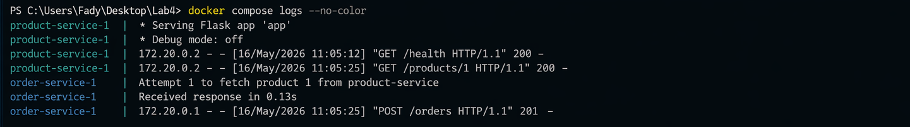

<p align="center">
  
  
  
</p>

<h1 align="center">Microservices Architecture</h1>

<p align="center">
  <i>Building resilient, independently deployable services</i>
</p>

<p align="center">
  <a href="#-quick-start">Quick Start</a> |
  <a href="#-services">Services</a> |
  <a href="#-fault-tolerance">Fault Tolerance</a> |
  <a href="#-demo-scenarios">Demo Scenarios</a>
</p>

---

## Overview

This lab implements a **production-grade microservices system** demonstrating service-to-service communication, fault tolerance patterns, and recovery mechanisms. You'll build and break things to understand how resilient systems behave.

### What You'll Learn

| Concept | Description |
|---------|-------------|
| Service Independence | Design services with single responsibility |
| Inter-Service Communication | REST-based synchronous communication |
| Fault Tolerance | Graceful degradation when services fail |
| Recovery Patterns | Automatic recovery after service restoration |

---

## Quick Start

```bash
# Start all services
docker compose up --build -d

# Check health
curl http://localhost:5001/health  # Product Service
curl http://localhost:5002/health  # Order Service

# Create an order
curl -X POST http://localhost:5002/orders \
  -H "Content-Type: application/json" \
  -d '{"product_id": 1, "quantity": 2}'
```

---

## Architecture

```
                        +---------------------------+
                        |      CLIENT LAYER         |
                        |  (curl / Postman / App)   |
                        +-------------+-------------+
                                      |
                    +-----------------+-----------------+
                    |                                   |
                    v                                   v
+---------------------------------------+   +---------------------------------------+
|          ORDER SERVICE                |   |         PRODUCT SERVICE              |
|           (Port 5002)                 |   |          (Port 5001)                 |
+---------------------------------------+   +---------------------------------------+
|                                       |   |                                       |
|   +-----------------------------+     |   |   +-----------------------------+    |
|   |     POST /orders            |     |   |   |   GET /products/<id>        |    |
|   |                             |     |   |   |                             |    |
|   |  1. Validate request        |-----+---+-->|  1. Lookup product          |    |
|   |  2. Call Product Service    |     |   |   |  2. Return product data     |    |
|   |  3. Calculate total         |<----+---+---|                             |    |
|   |  4. Return order response   |     |   |   +-----------------------------+    |
|   +-----------------------------+     |   |                                       |
|                                       |   |   +-----------------------------+    |
|   +-----------------------------+     |   |   |   GET /health               |    |
|   |  RESILIENCE LAYER           |     |   |   |   Health check endpoint     |    |
|   |  - Retry logic (3 attempts) |     |   |   +-----------------------------+    |
|   |  - Timeout handling         |     |   |                                       |
|   |  - Fallback responses       |     |   |   Product Catalog:                   |
|   +-----------------------------+     |   |   - Laptop:  $999.99                 |
+---------------------------------------+   |   - Phone:   $699.99                 |
                    |                       |   - Tablet:  $499.99                 |
                    |                       +---------------------------------------+
                    |                                   |
                    +-----------------------------------+
                                      |
                    +-----------------v-----------------+
                    |          DOCKER NETWORK           |
                    |      (Internal Communication)     |
                    +-----------------------------------+
```

---

## Services

### Product Service (Port 5001)

The **Product Service** manages the product catalog. It's the source of truth for product information.

| Endpoint | Method | Description |
|----------|--------|-------------|
| `/health` | GET | Health check |
| `/products/<id>` | GET | Get product by ID |

**Product Catalog:**

```json
[
  {"id": 1, "name": "Laptop", "price": 999.99, "stock": 50},
  {"id": 2, "name": "Phone", "price": 699.99, "stock": 100},
  {"id": 3, "name": "Tablet", "price": 499.99, "stock": 75}
]
```

**Example Request:**

```bash
curl http://localhost:5001/products/1
```

**Response:**

```json
{
  "id": 1,
  "name": "Laptop",
  "price": 999.99,
  "stock": 50
}
```

---

### Order Service (Port 5002)

The **Order Service** processes customer orders by communicating with the Product Service.

| Endpoint | Method | Description | Request Body |
|----------|--------|-------------|--------------|
| `/health` | GET | Health check | - |
| `/orders` | POST | Create order | `{"product_id": 1, "quantity": 2}` |

**Example Request:**

```bash
curl -X POST http://localhost:5002/orders \
  -H "Content-Type: application/json" \
  -d '{"product_id": 1, "quantity": 2}'
```

**Success Response:**

```json
{
  "order_id": "ord_a1b2c3d4",
  "product": "Laptop",
  "quantity": 2,
  "unit_price": 999.99,
  "total": 1999.98,
  "status": "confirmed"
}
```

---

## Fault Tolerance

### Error Handling Flow

```
+------------------------------------------------------------------+
|                    FAULT TOLERANCE FLOW                           |
|                                                                   |
|   REQUEST                                                         |
|      |                                                            |
|      v                                                            |
|   +------------------+                                            |
|   |  Try API Call    |                                            |
|   +--------+---------+                                            |
|            |                                                      |
|     +------+------+                                               |
|     |             |                                               |
|  SUCCESS       FAILURE                                            |
|     |             |                                               |
|     v             v                                               |
|  +-------+    +------------------+                                |
|  |RETURN |    | Retry (3 times)  |                                |
|  |RESULT |    +--------+---------+                                |
|  +-------+             |                                          |
|                 +------+------+                                   |
|                 |             |                                   |
|              SUCCESS       ALL FAILED                             |
|                 |             |                                   |
|                 v             v                                   |
|            +-------+    +------------------+                      |
|            |RETURN |    | Return Fallback  |                      |
|            |RESULT |    | Error Response   |                      |
|            +-------+    +------------------+                      |
+------------------------------------------------------------------+
```

### Failure Scenarios & Responses

| Scenario | System Behavior | Response |
|----------|-----------------|----------|
| Product service down | Graceful error after retries | `{"error": "Product service unavailable", "status": "failed"}` |
| Product not found | 404 handling | `{"error": "Product not found"}` |
| Network timeout | Retry with backoff | Automatic retry up to 3 times |
| Invalid request | Validation error | `{"error": "Invalid product_id"}` |

---

## Demo Scenarios

### Scenario 1: Happy Path (Success Flow)

```bash
# 1. Verify both services are healthy
curl http://localhost:5001/health
# {"service": "product-service", "status": "healthy"}

curl http://localhost:5002/health
# {"service": "order-service", "status": "healthy"}

# 2. View available product
curl http://localhost:5001/products/1
# {"id": 1, "name": "Laptop", "price": 999.99, "stock": 50}

# 3. Create an order
curl -X POST http://localhost:5002/orders \
  -H "Content-Type: application/json" \
  -d '{"product_id": 1, "quantity": 2}'
# {"order_id": "...", "product": "Laptop", "total": 1999.98, "status": "confirmed"}
```

---

### Scenario 2: Failure Simulation

```bash
# 1. Stop the Product Service (simulate outage)
docker compose stop product-service

# 2. Attempt to create an order
curl -X POST http://localhost:5002/orders \
  -H "Content-Type: application/json" \
  -d '{"product_id": 1, "quantity": 2}'

# Response (after retries):
# {"error": "Product service unavailable", "status": "failed"}

# OBSERVATION: Order Service handles failure gracefully
# - No crash or 500 error
# - Clear error message returned to client
# - System remains operational for other requests
```

---

### Scenario 3: Recovery

```bash
# 1. Restart Product Service
docker compose start product-service

# 2. Wait for service to be healthy
sleep 5
curl http://localhost:5001/health
# {"service": "product-service", "status": "healthy"}

# 3. Retry the order
curl -X POST http://localhost:5002/orders \
  -H "Content-Type: application/json" \
  -d '{"product_id": 1, "quantity": 2}'
# {"order_id": "...", "product": "Laptop", "total": 1999.98, "status": "confirmed"}

# OBSERVATION: System automatically recovered
# - No manual intervention required
# - Normal operation resumed
```

---

## Screenshots

| Containers Running | Product Service Health |
|:------------------:|:----------------------:|
|  |  |

| Product Data | Order Success |
|:------------:|:-------------:|
|  |  |

| Failure Simulation | Recovery |
|:------------------:|:--------:|
|  |  |

### Service Communication Logs


---

## Project Structure

```
Lab4/
├── docker-compose.yml          # Service orchestration
├── README.md                   # This file
│
├── product-service/
│   ├── app.py                  # Product catalog API
│   ├── Dockerfile              # Container definition
│   └── requirements.txt        # Dependencies
│
├── order-service/
│   ├── app.py                  # Order processing API
│   ├── Dockerfile              # Container definition
│   └── requirements.txt        # Dependencies
│
└── screenshots/                # Demo screenshots
```

---

## Docker Compose Configuration

```yaml
version: '3.8'

services:
  product-service:
    build: ./product-service
    ports:
      - "5001:5001"
    healthcheck:
      test: ["CMD", "curl", "-f", "http://localhost:5001/health"]
      interval: 10s
      timeout: 5s
      retries: 3

  order-service:
    build: ./order-service
    ports:
      - "5002:5002"
    environment:
      - PRODUCT_SERVICE_URL=http://product-service:5001
    depends_on:
      - product-service
```

### Key Configuration Points

| Setting | Purpose |
|---------|---------|
| `healthcheck` | Enables Docker to monitor service health |
| `depends_on` | Ensures Product Service starts before Order Service |
| `environment` | Passes Product Service URL to Order Service |
| Internal network | Services communicate via Docker DNS |

---

## Microservices Design Principles

| Principle | Our Implementation |
|-----------|-------------------|
| **Single Responsibility** | Product Service = catalog, Order Service = orders |
| **Loose Coupling** | Services communicate only via REST APIs |
| **Independent Deployment** | Each service has its own Dockerfile |
| **Fault Isolation** | Product Service failure doesn't crash Order Service |
| **Decentralized Data** | Each service manages its own data |

---

## Key Takeaways

1. **Microservices enable independent scaling** - Scale only the services under load
2. **Service communication introduces latency** - Network calls add overhead vs monolith
3. **Fault tolerance is essential** - Services must handle downstream failures gracefully
4. **Docker Compose simplifies local development** - Easy multi-service orchestration
5. **Health checks enable automation** - Orchestrators can manage service lifecycle

---

## Further Reading

- [Microservices Patterns](https://microservices.io/patterns/index.html)
- [Docker Compose Documentation](https://docs.docker.com/compose/)
- [Building Resilient Microservices](https://docs.microsoft.com/en-us/dotnet/architecture/microservices/)
- [Circuit Breaker Pattern](https://martinfowler.com/bliki/CircuitBreaker.html)

---

<p align="center">
  <a href="../Lab3/README.md">Previous: Lab 3 - Container Orchestration</a> |
  <a href="../README.md">Back to Main README</a>
</p>
