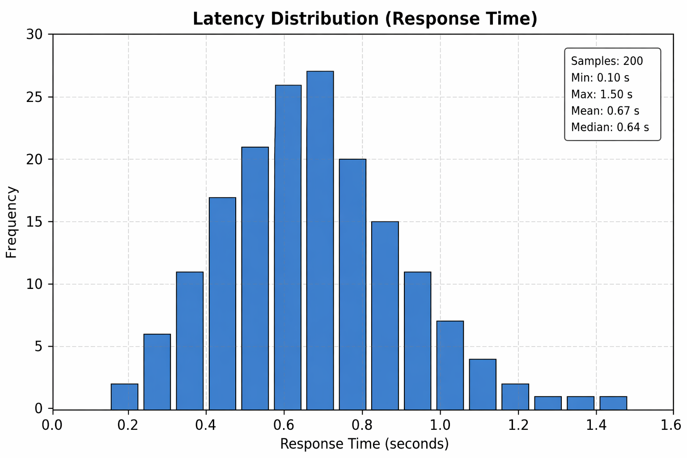

# Mobile Cloud System

A production-grade cloud-native system demonstrating modern mobile-cloud architecture, microservices patterns, container orchestration, and distributed systems principles.

[](https://github.com/Fadydesoky/Mobile-Cloud-System/actions/workflows/ci.yml)
[](https://fadydesoky.github.io/Mobile-Cloud-System/)
[](https://www.python.org/)
[](https://www.docker.com/)
[](https://kubernetes.io/)

**[View Live Demo](https://fadydesoky.github.io/Mobile-Cloud-System/)**

---

## Features

| Feature | Description |
|---------|-------------|
| **Microservices Architecture** | Independently deployable services with REST API communication |
| **Container Orchestration** | Docker containerization with Kubernetes deployment configurations |
| **Distributed Systems** | Redis-based distributed consistency simulation with CAP theorem demonstration |
| **Fault Tolerance** | Graceful failure handling, service recovery, and resilience patterns |
| **CI/CD Pipeline** | Automated testing, security scanning, and deployment via GitHub Actions |
| **Performance Analysis** | Latency measurement, tail latency analysis, and resource monitoring |

---

## System Architecture

```
┌─────────────────────────────────────────────────────────────────────────────┐
│                              MOBILE CLIENT                                   │
│                         (React Dashboard / Mobile App)                       │
└─────────────────────────────────┬───────────────────────────────────────────┘
                                  │ HTTP/REST
                                  ▼
┌─────────────────────────────────────────────────────────────────────────────┐
│                           API GATEWAY LAYER                                  │
│                          (Load Balancing / Routing)                          │
└──────────────┬─────────────────────────────────────────┬────────────────────┘
               │                                         │
               ▼                                         ▼
┌──────────────────────────────┐       ┌──────────────────────────────────────┐
│       ORDER SERVICE          │       │         PRODUCT SERVICE               │
│    ┌──────────────────┐      │       │      ┌──────────────────┐            │
│    │   Flask API      │      │  ───► │      │   Flask API      │            │
│    │   Port: 5002     │      │       │      │   Port: 5001     │            │
│    └──────────────────┘      │       │      └──────────────────┘            │
│    ┌──────────────────┐      │       │      ┌──────────────────┐            │
│    │  Health Check    │      │       │      │  Health Check    │            │
│    │  Retry Logic     │      │       │      │  Product Data    │            │
│    └──────────────────┘      │       │      └──────────────────┘            │
└──────────────────────────────┘       └──────────────────────────────────────┘
               │                                         │
               └─────────────────┬───────────────────────┘
                                 │
                                 ▼
┌─────────────────────────────────────────────────────────────────────────────┐
│                         CONTAINER ORCHESTRATION                              │
│  ┌─────────────────┐  ┌─────────────────┐  ┌─────────────────────────────┐  │
│  │  Docker Engine  │  │   Kubernetes    │  │     Docker Compose          │  │
│  │  Containerized  │  │   HPA / Probes  │  │   Service Networking        │  │
│  └─────────────────┘  └─────────────────┘  └─────────────────────────────┘  │
└─────────────────────────────────────────────────────────────────────────────┘
                                 │
                                 ▼
┌─────────────────────────────────────────────────────────────────────────────┐
│                        DISTRIBUTED DATA LAYER                                │
│  ┌───────────────────────────────────────────────────────────────────────┐  │
│  │                         Redis Cluster                                  │  │
│  │   ┌─────────────┐         ┌─────────────┐         ┌─────────────┐     │  │
│  │   │   Primary   │ ──────► │   Replica   │ ──────► │   Replica   │     │  │
│  │   │   (Write)   │         │   (Read)    │         │   (Read)    │     │  │
│  │   └─────────────┘         └─────────────┘         └─────────────┘     │  │
│  │                    Eventual Consistency                                │  │
│  └───────────────────────────────────────────────────────────────────────┘  │
└─────────────────────────────────────────────────────────────────────────────┘
```

---

## Project Structure

```
Mobile-Cloud-System/
├── Lab1/                    # Virtualization & Cloud Fundamentals
│   ├── app.py               # Flask API with latency simulation
│   ├── Dockerfile
│   └── screenshots/
│
├── Lab2/                    # Distributed Systems & Consistency
│   ├── app.py               # Redis integration API
│   ├── docker-compose.yml   # Multi-node Redis setup
│   └── screenshots/
│
├── Lab3/                    # Container Orchestration
│   ├── app.py               # Production-ready Flask API
│   ├── Dockerfile.basic
│   ├── Dockerfile.multistage
│   ├── deployment.yaml      # Kubernetes deployment
│   ├── service.yaml         # Kubernetes service
│   ├── tests/               # Unit tests with pytest
│   └── screenshots/
│
├── Lab4/                    # Microservices Architecture
│   ├── order-service/       # Order processing microservice
│   ├── product-service/     # Product catalog microservice
│   ├── docker-compose.yml   # Service orchestration
│   ├── tests/               # Integration tests
│   └── screenshots/
│
├── frontend/                # React Dashboard
│   ├── src/
│   └── screenshots/
│
└── .github/workflows/       # CI/CD Pipeline
    └── ci.yml
```

---

## Quick Start

### Option 1: Run with Docker Compose (Recommended)

```bash
# Clone the repository
git clone https://github.com/Fadydesoky/Mobile-Cloud-System.git
cd Mobile-Cloud-System

# Start the microservices system
cd Lab4
docker compose up --build

# Access the services
# Product Service: http://localhost:5001
# Order Service:   http://localhost:5002
```

### Option 2: Run Individual Components

```bash
# Backend (Lab3)
cd Lab3
docker build -f Dockerfile.basic -t mobile-cloud-api .
docker run -p 5000:5000 mobile-cloud-api

# Frontend
cd frontend
npm install
npm start

# Access: http://localhost:3000
```

---

## Demo Workflows

### Creating an Order

```bash
# 1. Check Product Service health
curl http://localhost:5001/health
# Response: {"service": "product-service", "status": "healthy"}

# 2. Get product details
curl http://localhost:5001/products/1
# Response: {"id": 1, "name": "Laptop", "price": 999.99, "stock": 50}

# 3. Create an order
curl -X POST http://localhost:5002/orders \
  -H "Content-Type: application/json" \
  -d '{"product_id": 1, "quantity": 2}'
# Response: {"order_id": "...", "status": "confirmed", "total": 1999.98}
```

### Simulating Failure & Recovery

```bash
# 1. Stop the Product Service
docker compose stop product-service

# 2. Attempt to create an order (will fail gracefully)
curl -X POST http://localhost:5002/orders \
  -H "Content-Type: application/json" \
  -d '{"product_id": 1, "quantity": 2}'
# Response: {"error": "Product service unavailable", "status": "failed"}

# 3. Restart the Product Service
docker compose start product-service

# 4. Retry the order (succeeds)
curl -X POST http://localhost:5002/orders \
  -H "Content-Type: application/json" \
  -d '{"product_id": 1, "quantity": 2}'
# Response: {"order_id": "...", "status": "confirmed", "total": 1999.98}
```

---

## API Reference

### Lab3 API (Core Service)

| Endpoint | Method | Description |
|----------|--------|-------------|
| `/` | GET | Returns response time with simulated latency |
| `/data?size=100` | GET | Returns generated dataset of specified size |
| `/health` | GET | Service health check |

### Lab4 APIs (Microservices)

**Product Service** (Port 5001)

| Endpoint | Method | Description |
|----------|--------|-------------|
| `/health` | GET | Health check |
| `/products/<id>` | GET | Get product by ID |

**Order Service** (Port 5002)

| Endpoint | Method | Description |
|----------|--------|-------------|
| `/health` | GET | Health check |
| `/orders` | POST | Create new order |

---

## Labs Overview

| Lab | Topic | Key Concepts |
|-----|-------|--------------|
| [Lab 1](Lab1/README.md) | Virtualization & Cloud | VM vs Containers, Latency Analysis, AWS EC2, Tail Latency |
| [Lab 2](Lab2/README.md) | Distributed Systems | Redis Replication, CAP Theorem, Eventual Consistency |
| [Lab 3](Lab3/README.md) | Container Orchestration | Docker Multi-stage Builds, Kubernetes, Health Probes |
| [Lab 4](Lab4/README.md) | Microservices | Service Communication, Fault Tolerance, Recovery Patterns |

---

## Technology Stack

| Category | Technologies |
|----------|--------------|
| **Backend** | Python 3.10+, Flask, Gunicorn |
| **Frontend** | React 18, JavaScript ES6+ |
| **Containers** | Docker, Docker Compose |
| **Orchestration** | Kubernetes (Deployment, Services, HPA) |
| **Distributed Systems** | Redis (Primary-Replica Replication) |
| **CI/CD** | GitHub Actions |
| **Testing** | pytest, Jest, Coverage |
| **Security** | Bandit (SAST), Trivy (Container Scanning) |

---

## CI/CD Pipeline

The project implements a comprehensive CI/CD pipeline with the following stages:

```
┌──────────────┐     ┌──────────────┐     ┌──────────────┐     ┌──────────────┐
│   Backend    │     │    Code      │     │   Security   │     │   Frontend   │
│    Tests     │     │   Quality    │     │    Scan      │     │    Build     │
│  (py 3.9-11) │     │   (Lint)     │     │  (Bandit)    │     │   (React)    │
└──────┬───────┘     └──────┬───────┘     └──────┬───────┘     └──────┬───────┘
       │                    │                    │                    │
       └────────────────────┴────────────────────┴────────────────────┘
                                      │
                                      ▼
                          ┌──────────────────────┐
                          │    Docker Build      │
                          │   & Trivy Scan       │
                          └──────────┬───────────┘
                                     │
                                     ▼
                          ┌──────────────────────┐
                          │  Integration Tests   │
                          │  (Docker Compose)    │
                          └──────────┬───────────┘
                                     │
                                     ▼
                          ┌──────────────────────┐
                          │   Deploy to GitHub   │
                          │       Pages          │
                          └──────────────────────┘
```

---

## Key Concepts Demonstrated

- **Virtualization vs Containerization**: Resource efficiency and isolation trade-offs
- **Cloud Infrastructure**: AWS EC2, Nitro Hypervisor architecture
- **Distributed Consistency**: CAP Theorem, Eventual Consistency, Replication Lag
- **Container Orchestration**: Kubernetes Deployments, Services, Horizontal Pod Autoscaling
- **Microservices Patterns**: Service Discovery, Inter-service Communication, Circuit Breaker
- **Fault Tolerance**: Graceful Degradation, Retry Mechanisms, Health Monitoring
- **DevOps Practices**: Infrastructure as Code, Automated Testing, Continuous Deployment

---

## Screenshots

<details>
<summary><strong>Infrastructure & Deployment</strong></summary>

### Docker Build Process


### Docker Images


### Kubernetes Pods


</details>

<details>
<summary><strong>Microservices (Lab 4)</strong></summary>

### Containers Running


### Order Creation Success


### Failure Simulation


### Service Recovery


### Service Communication Logs


</details>

<details>
<summary><strong>Monitoring & Analysis</strong></summary>

### Latency Distribution


### System Resource Usage


### Redis Distributed Simulation


</details>

<details>
<summary><strong>Frontend Dashboard</strong></summary>

### React Dashboard


</details>

---

## Contributing

1. Fork the repository
2. Create a feature branch (`git checkout -b feature/improvement`)
3. Commit changes (`git commit -am 'Add new feature'`)
4. Push to branch (`git push origin feature/improvement`)
5. Open a Pull Request

---

## License

This project is developed for educational purposes as part of a Mobile and Cloud Computing course.

---

## Author

**Fady Desoky**

[](https://www.linkedin.com/in/fadydesokysaeedabdelaziz/)
[](https://github.com/Fadydesoky)
